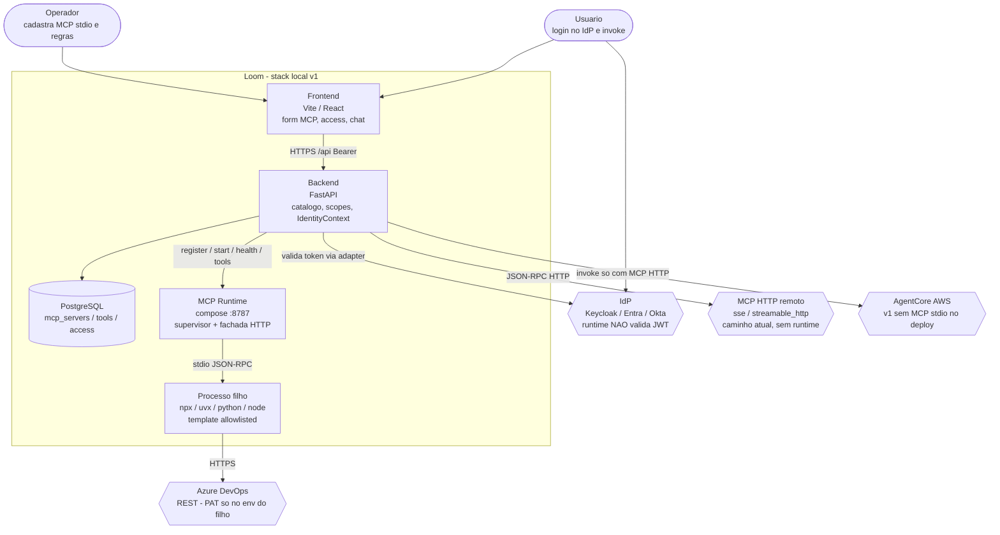
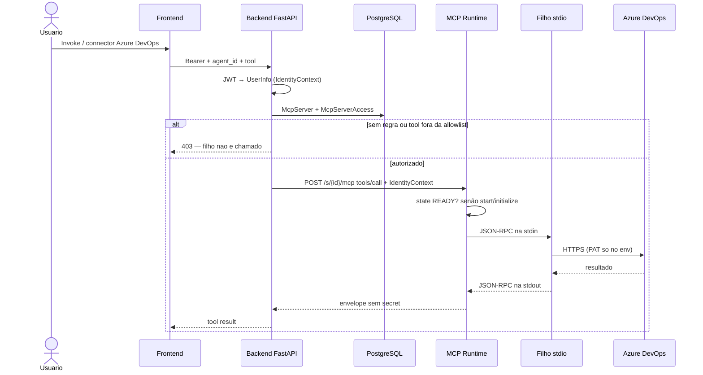

# 4. Runtime de MCP local (stdio) atrás do catálogo existente

- **Status:** Proposta (não implementar até validar com as specs 006–010)
- **Data:** 2026-09-12
- **Decisores:** Mantenedores da plataforma
- **Relacionada a:** [Spec 005 — análise MCP](../specs/005-existing-mcp-architecture.md), [ADR 0001 — IdP](0001-keycloak-as-identity-provider.md), [ADR 0005 — Local Agent Runtime](0005-local-agent-runtime.md), [ADR 0006 — Extensão local-runtime](0006-local-runtime-extension-repo.md)

## Problema

Alguns MCPs só existem como processo local (`npx`, `uvx`, `python`, `node`) e
falam MCP em **stdio**. O Loom hoje só registra MCP **HTTP** (`sse` /
`streamable_http`). Queremos disponibilizá-los aos agentes como MCP normal,
com autenticação, autorização, secrets, lifecycle e observabilidade do Loom,
**sem** expor o processo ao usuário e **sem** um adapter por produto
(Azure DevOps, GitHub, …).

Restrições:

- não depender de Keycloak, Entra, Okta ou Auth0 no runtime;
- não executar comando arbitrário enviado pelo usuário;
- não colocar secret em log, prompt, tool response, trace ou erro;
- não quebrar MCP remotos já cadastrados;
- Azure DevOps é só o primeiro exemplo.

## Decisão

Introduzir um **Local MCP Runtime / Host** como *bridge*, não como segundo
catálogo:

```text
Agente / control plane
    │  streamable HTTP + auth do Loom (já existente)
    ▼
Local MCP Runtime          ← lifecycle, política, secrets, Isolation
    │  stdio (JSON-RPC MCP)
    ▼
Processo filho (template aprovado: Azure DevOps, GitHub, …)
```

Princípios:

1. **Um catálogo.** `McpServer` ganha `transport_type=stdio`. O agente continua
   vendo um MCP HTTP. O `endpoint_url` de um servidor stdio é **interno e
   gerado** (fachada do runtime), nunca uma URL pública.
2. **Templates, não command livre.** O operador escolhe um `template_id`
   allowlisted (`azure-devops`, depois `github`, …). `command`/`args` vêm do
   template + parâmetros validados. Isso é a estratégia de registration
   confiável.
3. **IdentityContext = UserInfo.** O runtime recebe `sub`, `groups`, `scopes`,
   `agent_id`, `session_id`. Não valida JWT. Auth continua no Loom
   (`require_scopes`, IdP ACL).
4. **Autorização User → Agent → MCP → Tool** usa `McpServerAccess` (já no
   modelo) e **passa a ser enforced** no invoke e no `tools/call` do runtime.
5. **SecretReference**, não secret inline. Backend pluggable: `env` no
   compose local; AWS Secrets Manager na implantação. O runtime só vê o valor
   no env do **filho**, nunca na resposta.
6. **O filho não compartilha o processo do Loom.** Supervisor separado
   (serviço compose / subprocess isolado). Timeouts, restart, stdout/stderr
   capturados. Sem acesso arbitrário à memória do FastAPI.
7. **Azure DevOps não entra no core.** É um arquivo de template + secret
   `AZURE_DEVOPS_PAT`.

### Como funciona (C4 nível 2)

Nível 2 = **containers** (processos implantáveis), não classes. O sistema
é o stack local do Loom. Sistemas de fora da fronteira não veem stdio.

C4 L2 em Mermaid portátil (`flowchart`, não o dialeto `C4Container`, que
o preview do GitHub/Cursor em geral não desenha). Pessoas = estádio;
containers internos = caixas; sistemas externos = caixas pontilhadas.



Fluxo de um `tools/call` (o agente nunca vê o `npx`):



Passo a passo da v1:

1. Operador escolhe template `azure-devops` (não digita `command`). O backend
   valida `template_id` + params, grava `McpServer(transport_type=stdio)` e
   manda `register`/`start` ao runtime.
2. O runtime faz `Popen` da allowlist (`npx -y @azure-devops/mcp …`), injeta
   secrets só no env do filho e corre `initialize` + `tools/list` em stdio.
3. O `endpoint_url` gravado é `http://mcp-runtime:8787/s/{id}/mcp`. Para o
   resto do Loom isso é um MCP `streamable_http` interno.
4. No invoke, o backend monta IdentityContext a partir do `UserInfo` (já
   independente do IdP), aplica User → Agent → MCP → Tool e só então
   encaminha o `tools/call`.
5. A porta `8787` publica só em `127.0.0.1`. Anônimo e AgentCore na AWS não
   alcançam o processo stdio.

### Independência do IdP

```text
IdentityContext
  subject      ← UserInfo.sub
  username     ← UserInfo.username
  groups       ← UserInfo.groups
  scopes       ← UserInfo.scopes
  agent_id
  session_id
```

O runtime autoriza com esse contexto. Trocar Keycloak por Entra não altera
uma linha do supervisor.

### Exposição

```text
Usuário da internet  ──✘──►  processo stdio
Usuário autenticado no Loom  ──►  API Loom  ──►  Runtime  ──►  stdio
```

A fachada HTTP do runtime escuta só na rede Docker / loopback. Sem
autenticação Loom (token do usuário ou credencial de serviço do backend) a
fachada recusa. Um anônimo não alcança o Azure DevOps MCP.

### Alcance da v1

O runtime vive no **stack local** (compose). Agentes AgentCore na AWS **não**
chamam `npx` na laptop do desenvolvedor. Eles continuam com MCP HTTP remoto.
Um sidecar do mesmo runtime no ambiente do agente é evolução posterior, com
a mesma interface.

## Alternativas consideradas

| # | Ideia | Veredito |
| --- | --- | --- |
| 1 | Expor cada MCP local em HTTP aberto | **Rejeitada.** Sem auth Loom, sem RBAC, superfície de ataque. |
| 2 | Adapter específico por MCP (Azure DevOps Adapter) | **Rejeitada.** Cada produto novo muda o core. O pedido proíbe isso. |
| 3 | MCP Gateway genérico (produto separado) | **Adiada.** Duplicaria o catálogo. O runtime *é* o gateway mínimo, atrás do catálogo que já existe. |
| 4 | Local MCP Runtime/Host | **Escolhida.** Um supervisor + fachada HTTP interna + templates. |
| 5 | Containerizar cada MCP | **Complementar, não v1.** Isolamento melhor; custo operacional alto no compose atual. Templates podem ganhar `runtime.kind=container` depois sem mudar o catálogo. |
| 6 | Executar MCP no processo principal do FastAPI | **Rejeitada.** Crash do filho derruba o Loom; mistura trust boundary; sem isolamento de env/secrets. |

## Consequências

- Estender `transport_type` e o formulário MCP; MCPs HTTP atuais não mudam.
- `endpoint_url` deixa de ser obrigatório na criação stdio (o runtime preenche).
- Precisamos de allowlist de templates versionada no repo
  (`local-runtime/services/mcp-runtime/templates/`; legado
  `local-runtime/templates/` e `etc/mcp-templates/` movidos).
- `McpServerAccess` deixa de ser só UI.
- `secrets.py` ganha uma interface; o caminho AWS permanece para produção.
- Agentes `source=local` usam conectores stdio via a mesma fachada
  (`mcp-runtime`); o **agent-runtime** (ADR 0005) faz o tool loop. O backend
  chama `ensure_stdio_ready` no invoke para re-provisionar após recreate.
  Templates vivem sob o serviço **mcp-runtime** (ownership do supervisor).

## O que não fazer

- Importar SDK do Azure DevOps no backend.
- Aceitar `command` livre no POST `/api/mcp/servers`.
- Expor a porta do runtime em `0.0.0.0` sem bind de loopback/rede interna.
- Fazer o runtime falar com Keycloak.
- Implementar antes das specs 006–010 serem aceitas.
