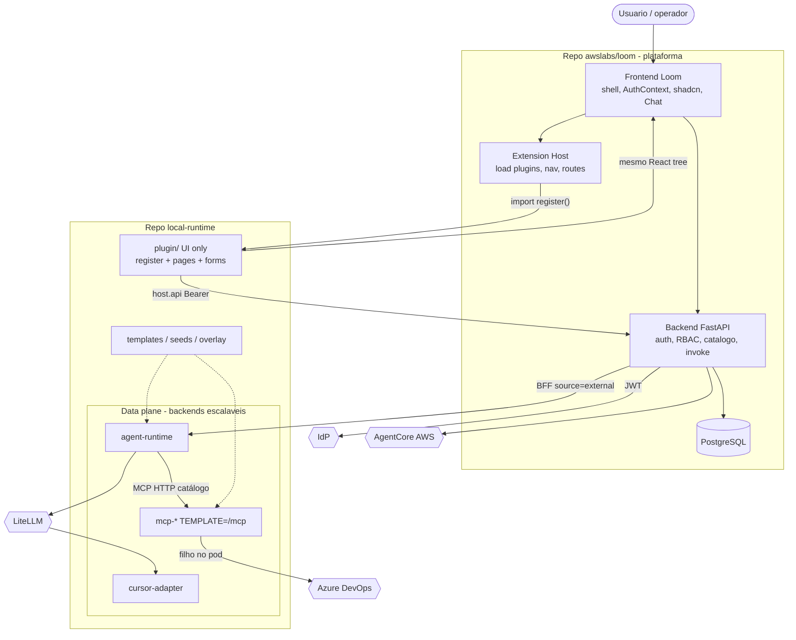
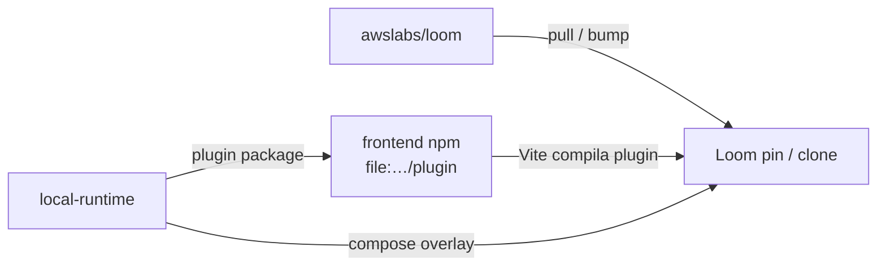

# 6. Extensão `local-runtime` como plugin instalável do Loom

- **Status:** Aceita (co-located sob `local-runtime/`; agent-runtime + BFF no
  overlay; MCP HTTP-only no Core — [ADR 0014](0014-mcp-host-isolated-http-registration.md)).
  Split de repo git opcional depois.
- **Data:** 2026-09-13
- **Atualizado:** 2026-09-15 — Fase “stdio no Core” encerrada (forms nativos HTTP)
- **Decisores:** Mantenedores da plataforma / extensão local
- **Relacionada a:**
  [ADR 0003 — LiteLLM](0003-litellm-as-llm-gateway.md),
  [ADR 0004](0004-local-mcp-runtime.md) *(histórico)*,
  [ADR 0014](0014-mcp-host-isolated-http-registration.md),
  [ADR 0005 — Local Agent Runtime](0005-local-agent-runtime.md),
  [ADR 0001 — IdP](0001-keycloak-as-identity-provider.md)

## Problema

O trabalho local (hosts MCP `TEMPLATE=`, cursor-adapter, agent-runtime, Hub,
telas de operação) estava **misturado** ao fonte do [awslabs/loom](https://github.com/awslabs/loom).
Isso impede atualizar o remoto com segurança: cada `git pull` / rebase
arrasta features de extensão pelo `backend/`, `frontend/` e
`docker-compose.yml`.

Uma SPA separada reusa auth via API, mas **não** o bundle do Loom. Lógica
no FastAPI não escala nem isola o data plane. Queremos:

1. Loom = plataforma atualizável + Extension Host.
2. **UI** = plugin instalável no mesmo React/Vite bundle.
3. **Tudo que não é UI** = backends apartados e escaláveis (out-of-process).
4. Tocar o Loom só com ganchos estáveis, não com features.

Restrições:

- não enfraquecer auth fail-closed / `net_guard` do Loom;
- plugin UI no **mesmo bundle** (não iframe como caminho principal);
- Chat do Loom usa agent/MCP local via gancho de invoke (ADR 0005);
- sidecars não rodam no processo FastAPI do Loom;
- tocar o Loom só com um **Extension Host** estável, não com features.

## Decisão

Princípio de corte (obrigatório):

```text
UI          → plugin no bundle do Loom (mesmo React tree)
Não-UI      → backends apartados, escaláveis, fora do processo FastAPI
```

Nada de lógica de runtime, supervisor, tool loop, PAT ou Popen no
frontend nem no uvicorn do Loom. Dois repositórios:

```text
awslabs/loom                 ← plataforma + Extension Host (UI slots + ganchos)
loom-local-runtime           ← plugin UI + backends + overlay
```

### Camadas

| Camada | Onde roda | Escala | Exemplos |
| --- | --- | --- | --- |
| **UI plugin** | Bundle Vite/React do Loom | Com o frontend | forms MCP local, health, nav |
| **Control plane** | FastAPI Loom (upstream) | API Loom | auth, RBAC, catálogo, invoke proxy |
| **Data plane** | Serviços compose próprios | H/V por serviço | mcp-runtime, agent-runtime, cursor-adapter |

O plugin UI só fala HTTP com o control plane (Bearer do usuário) e, quando
necessário, com APIs de ops dos backends (sempre autenticadas por token de
serviço ou via backend Loom como BFF — preferir BFF para não expor tokens
de runtime ao browser).

### Modelo de plugin (UI no bundle do Loom)

```text
Instalar
  npm/pnpm no frontend do Loom:
    "@loom-ext/local-runtime": "file:../../local-runtime/plugin"
  ou LOOM_EXTENSIONS=../local-runtime/plugin no compose de dev

Boot do frontend
  Extension Host lê manifest(s)
  → import() do entry do plugin
  → plugin.register(host)
  → host.addNavItems / host.addRoutes / host.addCatalogPanels

Runtime
  Mesmo AuthProvider, mesmos componentes UI, mesma rota no shell
  Telas do plugin chamam apiFetch do host (JWT já no cliente)
```

O plugin **não** traz React/ReactDOM próprios: `peerDependencies` no
React do Loom. Estilo: classes Tailwind / primitivos já usados pelo host
(ou `host.ui` se expusermos wrappers). Assim a tela “mora” no Loom sem
estar *escrita* no repo do Loom.

**Não** usar Module Federation na v1: install = dependência de path /
pacote versionado; o Vite do Loom compila o fonte do plugin juntos
(lazy route). Federation fica opção se no futuro houver vários plugins
binários sem rebuild.

### Contrato `LoomExtensionHost` (mínimo)

```text
register(host: LoomExtensionHost): void

host.manifest     id, version, displayName
host.addNavItem({ id, section, labelKey, href, requiredScopes? })
host.addRoute({ path, element, requiredScopes? })        // lazy OK
host.addCatalogContribution?({ … })                      // opcional
host.api          apiFetch / getAuthToken (mesmo client)
host.i18n         registerResources(ns, bundles)         // opcional v1
```

Descoberta v1:

```text
frontend/src/extensions/load.ts
  lê import.meta.env.VITE_LOOM_EXTENSIONS
  ou package.json "loomExtensions": ["@loom-ext/local-runtime"]
  dynamic import de cada entry "loom.extension"
```

Campo no `package.json` do plugin:

```text
"name": "@loom-ext/local-runtime",
"loom.extension": "./src/register.tsx",
"peerDependencies": { "react": "^18", "react-dom": "^18" }
```

### Backends apartados (tudo que não é UI)

Cada capacidade local é um **serviço** com lifecycle próprio:

| Serviço | Responsabilidade | Escala |
| --- | --- | --- |
| `mcp-*` (mesma imagem) | Host MCP `TEMPLATE=` → `POST /mcp` | 1 serviço Compose por template |
| `agent-runtime` | Tool loop local, SSE de invoke | N sessões; hard limit; scale-out depois |
| `cursor-adapter` | CustomLLM → Cursor SDK | Réplicas stateless atrás do LiteLLM |
| LiteLLM | Gateway de modelo (já ADR 0003) | Já apartado |

Regras:

1. **Crash** de um backend não derruba o Loom API nem o plugin UI.
2. **Scale** = réplicas / limits do serviço, não workers do uvicorn.
3. **Secrets** de runtime ficam no env do serviço (ou SM), nunca no bundle.
4. O plugin **não** implementa negócio: só formulários, status e chamadas API.
5. Preferir que o browser chame só o **Loom** (`/api/...`); o backend Loom
   encaminha aos runtimes (BFF). Exceção ops avançada: documentar e autenticar.

### Compose: todo backend sobe apartado

No `compose/overlay.yml` da extensão (e no stack local), **cada** capacidade
não-UI é um **serviço Compose distinto** — nunca processo filho do
`backend` Loom nem “thread no uvicorn”:

```text
services:
  backend:              # Loom control plane (imagem/repo upstream)
  frontend:             # Loom UI + plugin compilado no bundle
  postgres:
  keycloak:
  litellm:              # já apartado (ADR 0003)
  cursor-adapter:       # extensão — serviço próprio
  mcp-azure-devops:     # extensão — TEMPLATE=azure-devops
  mcp-rancher:          # extensão — TEMPLATE=rancher
  mcp-grafana:          # extensão — TEMPLATE=grafana
  agent-runtime:        # extensão — serviço próprio
```

Regras de compose:

1. `backend` do Loom **não** faz `build` dos runtimes locais; só recebe
   env (`AGENT_RUNTIME_URL`, `AGENT_RUNTIME_TOKEN`, tokens).
2. Overlay da extensão **adiciona** `cursor-adapter`, `mcp-*`,
   `agent-runtime` (e volumes de templates); não mistura código no
   container do FastAPI.
3. Healthcheck **por serviço**; `depends_on` só onde houver ordem real
   (ex. litellm → cursor-adapter).
4. Portas de data plane em loopback / rede Docker interna; escala =
   `deploy.replicas` / múltiplas réplicas do serviço, não workers extras
   do Loom.
5. `make extension.up` ≈  
   `docker compose -f $LOOM_ROOT/docker-compose.yml -f compose/overlay.yml up`.

Assim “tudo que é backend sobe apartado” é literal no Compose, alinhado
ao corte UI-plugin vs data plane.

### Ganchos mínimos no Loom (Extension Host)

| Gancho | Camada | Função |
| --- | --- | --- |
| Loader de plugins + slots nav/rota | frontend | Instala **só UI** no bundle |
| `AGENT_RUNTIME_URL` (+ token) | backend | BFF: `source=external` → proxy SSE (ADR 0005) |
| Catálogo MCP nativo | backend/UI | Só `sse` / `streamable_http` ([ADR 0014](0014-mcp-host-isolated-http-registration.md)) |
| Compose overlay env | ops | Injeta URLs/tokens; sobe backends da extensão |

SPA `:5174` **não** é o caminho. UI = plugin; compute = backends.

MCP local: Loom registra URLs HTTP; stdio só **dentro** dos pods `mcp-*`.

### Relação entre os dois repositórios (C4 L2)



Instalação / atualização:



### Estrutura de pastas final (repo `local-runtime`)

```text
local-runtime/
├── README.md
├── makefile
├── .env.example
├── compose/
│   └── overlay.yml
├── plugin/                          # SÓ UI — instalável no frontend Loom
│   ├── package.json                 # name: @loom-ext/local-runtime
│   ├── src/
│   │   ├── register.tsx             # export function register(host)
│   │   ├── pages/                   # LocalMcpPage, RuntimeHealthPage, …
│   │   ├── components/              # forms template / secrets (sem negócio)
│   │   ├── api/                     # host.api → Loom BFF apenas
│   │   └── locales/
│   └── tsconfig.json
├── services/                        # backends apartados (não-UI)
│   ├── mcp-runtime/                 # imagem + templates/ (TEMPLATE=)
│   ├── agent-runtime/
│   ├── cursor-adapter/
│   └── mcp-hub/
├── seeds/
├── docs/
│   ├── adr/
│   └── specs/
└── scripts/
    ├── up.sh
    ├── install-into-loom.sh         # link/npm i file:plugin no LOOM_ROOT
    └── bump-loom.sh
```

Layout de trabalho:

```text
~/work/
├── loom/
│   └── frontend/
│       ├── package.json             # dep file:../../local-runtime/plugin
│       └── src/extensions/          # loader do Host (gancho mínimo)
└── local-runtime/
```

Alvo dentro do Loom (só Host, sem features locais):

```text
loom/frontend/src/extensions/
├── types.ts          # LoomExtensionHost
├── load.ts           # discover + import
└── registry.ts       # nav items + routes merged into App
```

### Fases de migração

| Fase | Entrega | Critério |
| --- | --- | --- |
| **0** | Esta ADR + política plugin | Aceite explícito |
| **1** | Repo + sidecars/templates + overlay | runtimes sobem; testes isolados — **feito** |
| **2** | Extension Host no Loom + `plugin/register` | Telas locais no shell Loom — **feito** (ops page) |
| **3–4** | Loom só MCP HTTP; hosts `mcp-*` na extensão | **feito** ([ADR 0014](0014-mcp-host-isolated-http-registration.md)) |
| **5** | `agent-runtime` + `AGENT_RUNTIME_URL` | BFF + loop MCP — **feito**; aceite [014](../specs/014-local-agent-orientador-ado-acceptance.md) |
| **6** | CI extensão + `install-into-loom` / `bump-loom` | Pull awslabs sem rebase de feature |

### Auth, RBAC e visual

| Capacidade | Como o plugin se beneficia |
| --- | --- |
| Autenticação | Mesmo `AuthContext` / token do host; sem segundo login |
| RBAC | `requiredScopes` nas rotas/nav; APIs Loom com o mesmo Bearer |
| Shell / nav / layout | `host.addNavItem` + rotas dentro do `App` existente |
| Design system | Mesmo Tailwind/shadcn do bundle; plugin não empacota React |
| i18n | `host.i18n.registerResources` (v1 pode hardcodar pt-BR/en no plugin) |
| Chat | Continua no Loom; plugin não clona Chat |

## Alternativas consideradas

| # | Ideia | Veredito |
| --- | --- | --- |
| 1 | Tudo no fork do Loom | **Rejeitada.** Rebase eterno. |
| 2 | SPA separada `:5174` | **Rejeitada como UX principal.** Não compartilha bundle/shell. |
| 3 | iframe da SPA no shell | **Fallback só.** Frágil para auth/theme. |
| 4 | **UI = plugin no bundle; não-UI = backends** | **Escolhida.** Bundle + escala + isolamento. |
| 5 | Lógica de runtime no FastAPI ou no plugin | **Rejeitada.** Nem escalável nem isolada. |
| 6 | Module Federation runtime | **Adiada.** Path dep + mesmo Vite basta na v1. |
| 7 | Zero gancho no Loom | **Rejeitada** para Chat+tools e slots de UI. |
| 8 | Proxy na frente da API | **Rejeitada.** |

## Consequências

- Frontend do Loom ganha um Extension Host pequeno (tipos + loader + merge
  de nav/rotas) — isso **é** o mínimo tocável e candidato a PR upstream.
- Telas locais versionam no repo `local-runtime`; o Loom só declara a dep.
- Dev precisa `install-into-loom` (ou compose mount) para o Vite ver o plugin.
- peerDependency de React: versões desalinhadas quebram o build — pin
  documentado.
- Dívida `stdio` no Core: **encerrada** (ADR 0014); stdio só nos pods `mcp-*`.
- Sem segundo OIDC client só para UI (o plugin usa a sessão do Loom).

## O que não fazer

- Colocar tool loop, supervisor ou secrets no plugin UI ou no uvicorn.
- Continuar forms MCP “especiais” só no `frontend/src/components` do Loom
  (usar formulário nativo HTTP).
- Empacotar React duplicado no plugin.
- Validar JWT do IdP nos backends de data plane.
- Federation na v1 sem necessidade.
- Copiar o Chat para o plugin.
- Expor `MCP_RUNTIME_TOKEN` / `AGENT_RUNTIME_TOKEN` ao browser.
- Reintroduzir `MCP_RUNTIME_URL` / `transport=stdio` no Core.

## Specs / trabalho de acompanhamento

1. Spec Extension Host (API `register`, descoberta, scopes)
2. Layout repo + overlay + `install-into-loom` (Fase 1)
3. Plugin: páginas MCP local + health (Fase 2–3)
4. `AGENT_RUNTIME_URL` + aceite [014](../specs/014-local-agent-orientador-ado-acceptance.md)
