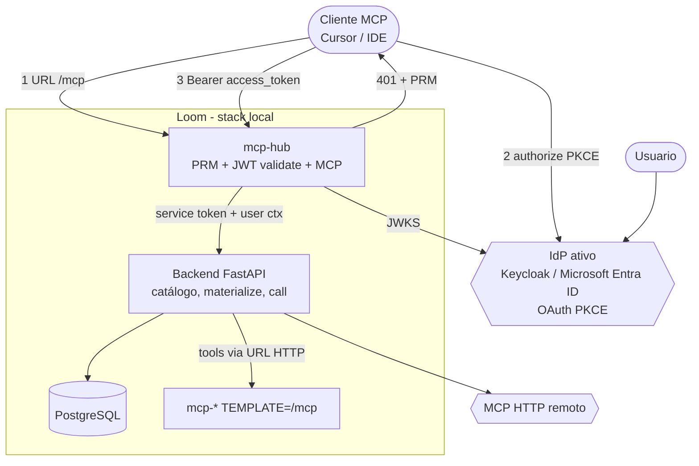

# 7. MCP Hub (Fase 1) — tools MCP governadas pelo Loom

- **Status:** Aceito (Fase 1 entregue; Fase 2 = [ADR 0012](0012-mcp-hub-agents-as-tools.md))
- **Data:** 2026-09-13
- **Atualizado:** 2026-09-15 — OAuth IdP; mint removido; tools só HTTP
  ([ADR 0014](0014-mcp-host-isolated-http-registration.md))
- **Decisores:** Mantenedores da plataforma / extensão local
- **Relacionada a:**
  [ADR 0001 — IdP](0001-keycloak-as-identity-provider.md),
  [ADR 0014 — MCP host isolado](0014-mcp-host-isolated-http-registration.md),
  [ADR 0005 — Local Agent Runtime](0005-local-agent-runtime.md),
  [ADR 0006 — Extensão local-runtime](0006-local-runtime-extension-repo.md),
  [ADR 0008 — MCP Clients](0008-mcp-hub-clients.md),
  [ADR 0011 — OAuth Hub](0011-mcp-hub-oauth-idp.md),
  [guia MCP host HTTP](../guide/mcp-host-http-registration.md)

## Problema

Clientes MCP externos (Cursor, Claude Desktop, IDEs) precisam de **um**
endpoint MCP que exponha apenas as tools que a **conta logada** pode usar,
segundo o control plane do Loom (IdP + RBAC + catálogo + `McpServerAccess`).

Hoje:

- o Chat/invoke já filtra conectores e tools por agente;
- não há fachada MCP **orientada ao usuário** para o IDE;
- ACL de MCP é **agent-centric** (`persona_id` → servidor → tools), não
  “user → tools” direto;
- validar JWT do IdP no data plane viola ADR 0004/0005.

Queremos um **MCP Hub** na extensão `local-runtime` que:

1. exija autenticação via IdP ativo do Loom;
2. disponibilize só tools MCP permitidas à conta;
3. **não** invoque agents nesta fase (Fase 2);
4. não crie segundo catálogo MCP;
5. não prefixe tools com `loom_`.

## Decisão

### Fase 1 (esta ADR)

Introduzir o serviço **`mcp-hub`** no `local-runtime` como *fachada MCP
user-facing*, com o Loom como única autoridade de identidade e autorização.

```text
Cliente MCP (Cursor / IDE)
    │  streamable HTTP + Bearer access_token (OAuth IdP — ADR 0011)
    ▼
mcp-hub  (local-runtime, data plane)
    │  valida JWT (JWKS) + allowlist / proxy tools/call
    │  PRM + 401 challenge; NÃO mint; NÃO aceita hs_…
    ▼
Loom FastAPI (control plane)
    │  catálogo, materialize, tools/call, grants
    ▼
Keycloak / Microsoft Entra ID (AS)  ←── browser OAuth PKCE do IDE
mcp-* (TEMPLATE=/mcp) / MCP HTTP remotos
```

### Princípios

1. **Um catálogo.** O Hub não cadastra servidores. Lê o catálogo Loom e
   encaminha para URLs `sse` / `streamable_http` (hosts locais = `mcp-*`).
2. **Login = IdP ativo do Loom (Keycloak / Microsoft Entra ID).** O MCP
   Client faz OAuth Authorization Code + PKCE; token no secret store do
   IDE ([ADR 0011](0011-mcp-hub-oauth-idp.md)). **Sem mint** e **sem**
   fallback `hs_…`. O fluxo é o mesmo qualquer que seja o IdP ativo.
3. **Hub como resource server.** Publica PRM; valida access token (JWKS /
   audience = URL canônica do Hub). Service token Hub↔Loom separado.
4. **Autorização:** [ADR 0008](0008-mcp-hub-clients.md) + grants por perfil
   ([ADR 0010](0010-mcp-hub-profile-grants.md)); discovery `clientInfo`
   ([ADR 0009](0009-mcp-hub-client-identification.md)).
5. **Só tools MCP na Fase 1.** Fase 2 = agents como tools MCP
   ([ADR 0012](0012-mcp-hub-agents-as-tools.md)); sem A2A por default.
6. **Nomes sem prefixo de produto.** Tools do Hub não usam prefixo `loom_`.
   Em colisão entre servidores, namespacar pelo **slug do servidor**.
7. **Extensão ADR 0006.** Código em `local-runtime/services/mcp-hub`;
   plugin documenta URL + OAuth. BFF: materialize/call (sem mint).
8. **Fail-closed.** Token inválido / sem ACL → list vazio ou 401/403;
   call fora da allowlist → 403.

### Como funciona (C4 nível 2)



### Fluxo de sessão (Fase 1 + ADR 0011)

1. IDE configura **só** a URL do Hub (`mcp.json` sem Bearer fixo).
2. Primeiro request → `401` + Protected Resource Metadata (024).
3. IDE completa OAuth no IdP ativo — Keycloak / Microsoft Entra ID
   (PKCE, `resource` = Hub).
4. IDE envia `Authorization: Bearer <access_token>` em `/mcp`.
5. Hub valida JWT; `initialize` descobre MCP Client; allowlist por perfil.
6. Refresh = OAuth do client; **não** há mint na UI Loom.

Detalhe de auth: [ADR 0011](0011-mcp-hub-oauth-idp.md).

### Fora de escopo (Fase 1)

- Invocar agents Loom via Hub — decidido em
  [ADR 0012](0012-mcp-hub-agents-as-tools.md) (Fase 2).
- Segundo catálogo MCP ou templates no Hub.
- Expor Hub em `0.0.0.0` sem auth em produção.
- Substituir o Chat do Loom; Chat continua no caminho invoke atual.

### Fase 2

[ADR 0012](0012-mcp-hub-agents-as-tools.md): agents como tools MCP
(`agent__{slug}`), opt-in por canal (`agents_enabled`), RBAC via
`loom:group` (sem grants de agent por perfil). A2A gateway **não** é o
default.

## Alternativas consideradas

| # | Opção | Resultado |
|---|--------|-----------|
| 1 | Hub só no FastAPI (BFF REST, sem MCP) | Rejeitada para IDE: Cursor espera MCP nativo. |
| 2 | Cliente MCP manda JWT do IdP ao Hub | Rejeitada: data plane não valida IdP (ADR 0004/0005). |
| 3 | ACL user→tool nova, ignorando agents | Rejeitada como default; ver ADR 0008 (MCP Client → tools na extensão). |
| 4 | Um Hub session = um agent/canal fixo | **Promovida** como MCP Client bound ([ADR 0008](0008-mcp-hub-clients.md)); não é Agent. União Fase 1 = interina. |
| 5 | Gateway MCP genérico no core (ADR 0004) | Rejeitada de novo: Hub é extensão local + BFF mínimo, não segundo catálogo. |
| 6 | Incluir invoke de agents na Fase 1 | Rejeitada por escopo; mercado trata agents ≠ tools (MCP vs A2A). |

## Consequências

- Novo serviço compose `mcp-hub` + health/port loopback; overlay ADR 0006.
- Auth IDE = OAuth IdP ([ADR 0011](0011-mcp-hub-oauth-idp.md)); BFF expõe
  `info` / materialize / tools-call (service token Hub↔Loom). Endpoints de
  mint retornam **410**.
- Allowlist **reavaliada** a cada `tools/list` / `tools/call` (grants por
  perfil IdP — [ADR 0010](0010-mcp-hub-profile-grants.md)).
- Colisões de nomes de tools entre servidores exigem regra de namespacing
  estável na spec.
- Testes: usuário sem grant → list vazio/403; tool grantada → call ok;
  token expirado / `hs_…` → 401; audience errada → 401.
- Plugin Local Runtime documenta URL do Hub + OAuth (sem botão mint).

## Specs a seguir

1. [016 — Contrato MCP](../specs/016-mcp-hub-contract.md)
2. [017 — Credencial / sessão OAuth](../specs/017-mcp-hub-session.md) · [024 — OAuth](../specs/024-mcp-hub-oauth.md)
3. [018 — Allowlist](../specs/018-mcp-hub-allowlist.md) (**default: [ADR 0008](0008-mcp-hub-clients.md)**)
4. [019 — Segurança](../specs/019-mcp-hub-security.md)
5. [020 — Observabilidade](../specs/020-mcp-hub-observability.md)
6. [ADR 0008 — MCP Clients](0008-mcp-hub-clients.md)
7. [ADR 0009 — Identificação MCP Client](0009-mcp-hub-client-identification.md)
8. [ADR 0010 — Grants por perfil](0010-mcp-hub-profile-grants.md)
9. [ADR 0011 — OAuth IdP](0011-mcp-hub-oauth-idp.md)
10. [ADR 0012 — Agents como tools](0012-mcp-hub-agents-as-tools.md)
11. [021](../specs/021-mcp-hub-clients.md) · [022](../specs/022-mcp-hub-client-identification.md) · [023](../specs/023-mcp-hub-profile-grants.md) · [025](../specs/025-mcp-hub-agents-as-tools.md)

Na segurança (019), v1 prefere `tools/call` via BFF Loom para não guardar
secrets de MCP remotos no Hub.
