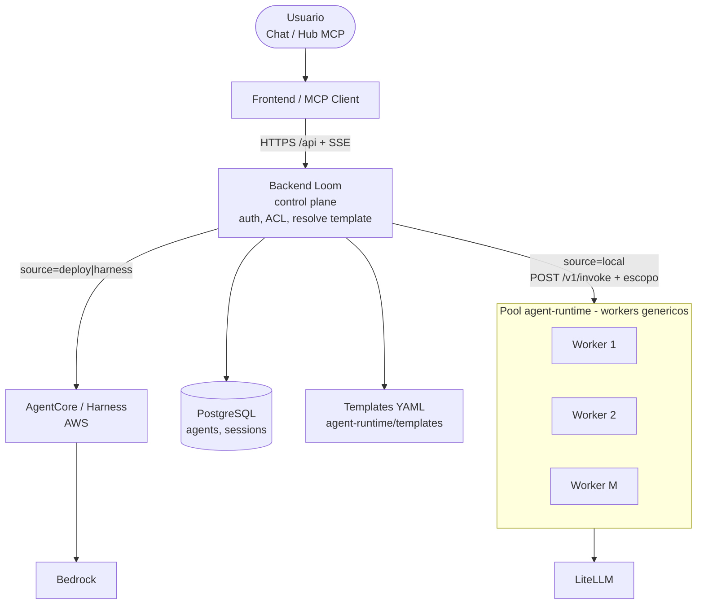
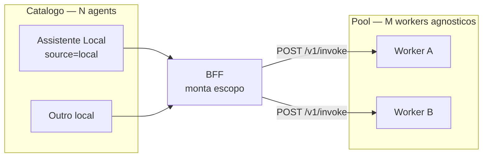
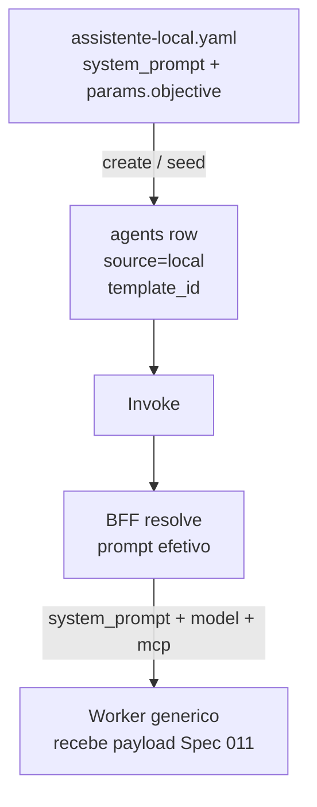
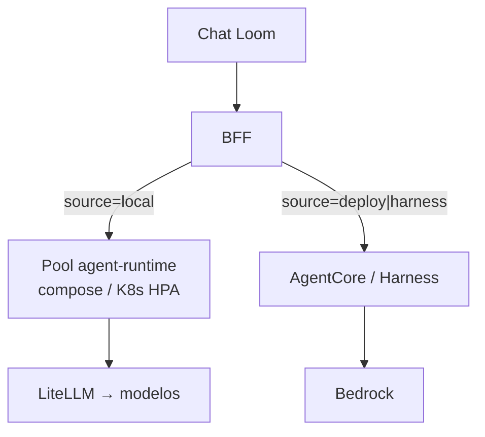

# 13. Agents locais por template + pool de workers (agnóstico de escopo)

- **Status:** Aceita (decisão de produto; implementação fasada)
- **Data:** 2026-09-14
- **Decisores:** Mantenedores da plataforma (fork)
- **Relacionada a:**
  [ADR 0005 — Local Agent Runtime](0005-local-agent-runtime.md),
  [ADR 0004 — Local MCP Runtime](0004-local-mcp-runtime.md),
  [ADR 0003 — LiteLLM](0003-litellm-as-llm-gateway.md),
  [ADR 0006 — Extensão local-runtime](0006-local-runtime-extension-repo.md),
  [Spec 026 — templates](../specs/026-local-agent-templates.md),
  [Spec 027 — pool / escala / sessão](../specs/027-local-agent-worker-pool.md)

## Problema

O ADR 0005 entregou o *data plane* local (`agent-runtime`) com o mesmo
contrato de invoke/SSE do Chat que o AgentCore. Ainda faltam três peças
de produto:

1. **Definição versionável** — agents locais nascem como seed opaco no
   Postgres (`local_agents.py`); não há analogia aos templates YAML do
   MCP (`mcp-runtime/templates/`). Behavior / system prompt **não**
   editável na UI do Detail para `source=local`.
2. **Placement** — um único processo no compose não deixa explícito o
   modelo de escala: catálogo com N agents ≠ N processos.
3. **Independência do AgentCore** — o projeto precisa conviver com
   agents **AWS (harness / AgentCore)** e agents **próprios** (compose
   hoje; Kubernetes depois) no **mesmo** control plane Loom, sem
   amarrar o produto ao AgentCore.

Restrições (herdadas + novas):

- um catálogo de agents no Loom (`agents`); adapters
  `agentcore | harness | local`;
- LiteLLM continua o único gateway de modelo no caminho local
  (ADR 0003); Bedrock fica no data plane AgentCore;
- MCP stdio só no `mcp-runtime` (ADR 0004);
- control plane **não** executa tool loop;
- Memory AgentCore **não** é a base de conhecimento de demo (ficheiro /
  prompt / tool);
- `cursor-local` / workspace no laptop = **dev-only**, fora do pool K8s
  de produção.

## Decisão

Diagramas em Mermaid portátil (`flowchart` / `sequenceDiagram`) — mesmo
padrão do [ADR 0005](0005-local-agent-runtime.md).

### Visão: dual path + catálogo vs pool



### 1. Registro ≠ instância

- **Catálogo:** muitos agents `source=local` (nome, tags, RBAC,
  `template_id`, params).
- **Data plane:** pool de workers **genéricos** (`agent-runtime`). O
  container/pod **não** “é” um agent do catálogo no boot.
- No invoke (Chat ou Hub `agent__*`): o BFF monta o **escopo**
  (prompt/behavior, `model_id`, MCP allowlist, identity, `session_id`)
  e um worker livre atende.
- Escala = **réplicas do pool** pela demanda, não 1 Deployment por
  agent registrado.



### 2. Templates de agent (espelho MCP)

Allowlist YAML sob a extension (dono: **agent-runtime**), análogo a
`mcp-runtime/templates/`:

- `id`, `display_name`, `system_prompt` (behavior), `model_id` default,
  MCP/templates referenciáveis, params/secrets schema;
- create/edit local = escolher template + params (aí entra behavior na
  UX), sem depender do formulário AgentCore;
- seed de demo migra para template (ex. `assistente-local` + params).



Detalhe: [Spec 026](../specs/026-local-agent-templates.md).

### 3. Estado de conversa no control plane

- Fonte da verdade: Postgres Loom (`invocation_sessions` /
  `invocations`) + histórico que o BFF reenvia / resolve por
  `session_id`.
- Worker: estado **efêmero do turno** (loop de tools naquele SSE).
- Entre turnos, **qualquer** réplica pode atender (stateless worker).
  Sticky session só como otimização opcional, não requisito.

```mermaid
sequenceDiagram
    actor U as Usuario
    participant FE as Frontend
    participant BE as Backend
    participant DB as Postgres
    participant W1 as Worker A
    participant W2 as Worker B
    participant LT as LiteLLM

    U->>FE: mensagem 1
    FE->>BE: POST invoke + JWT
    BE->>DB: cria session_id
    BE->>BE: resolve template → escopo
    BE->>W1: POST /v1/invoke SSE
    W1->>LT: chat/completions
    LT-->>W1: texto
    W1-->>BE: session_start / chunk / session_end
    BE->>DB: persiste invocation
    BE-->>FE: SSE

    U->>FE: mensagem 2 mesma sessao
    FE->>BE: POST invoke session_id
    BE->>DB: carrega historico / status
    BE->>W2: POST /v1/invoke escopo + contexto
    Note over W1,W2: Pod pode ser outro; estado nao vive no Worker A
    W2->>LT: chat/completions
    W2-->>BE: SSE
    BE-->>FE: SSE
```

Detalhe: [Spec 027](../specs/027-local-agent-worker-pool.md).

### 4. Dual path estável

| `source` | Data plane |
|----------|------------|
| `deploy` / `harness` | AgentCore / AWS |
| `local` | agent-runtime (compose → K8s) |

Mesmo Chat, mesmos eventos SSE (`session_start` / `chunk` /
`session_end` / `error`). Sem Kafka no caminho do turno conversacional.



### 5. Maturidade

| Fase | Entrega |
|------|---------|
| **A0** | Pool no compose (`AGENT_RUNTIME_REPLICAS≥2`); SSE `Connection: close` — *feito / em curso* |
| **A1** | Spec templates + schema YAML + template de exemplo — **feito** (loader) |
| **A2** | Registro create local a partir de template (BFF/UI) — **feito** (`assistente-local` + `/api/agents/local`) |
| **A3** | Deployment K8s do mesmo contrato HTTP + HPA |
| **A4** | (Opcional) isolamento mais forte / multi-tenant limits |

## Consequências

**Positivas**

- Product mental model alinhado a MCP templates.
- K8s-ready: HTTP + service token + payload de escopo; HPA no pool.
- Behavior versionável em git; resolve gap da UI local.
- AgentCore permanece opção de produção AWS, não monocultura.

**Negativas / trade-offs**

- Cancel/`sessions` in-memory do worker **não** é compartilhado entre
  réplicas até haver store partilhado ou cancel via BFF only.
- DNS RR / connection pool do cliente HTTP pode enviesar tráfego no
  compose — aceitável para testes; K8s Service é o alvo.
- Create UI local exige gancho Core (autorização Dev) ou só API/seed
  na extension primeiro.

## Não fazer

- Um container dedicado por agent do catálogo como desenho default.
- Usar AgentCore Memory como KB de ficheiros de demo.
- Colocar Kafka entre Chat e worker para o turno SSE.
- Validar JWT do usuário dentro do worker (auth continua no BFF).
- Embutir Cursor SDK / workspace host no pool K8s.

## Referências

- Contrato atual: [Spec 011](../specs/011-local-agent-runtime-contract.md)
- Segurança / obs: [012](../specs/012-local-agent-runtime-security.md),
  [013](../specs/013-local-agent-runtime-observability.md)
- Arquitetura viva: [guide/architecture.md](../guide/architecture.md)
