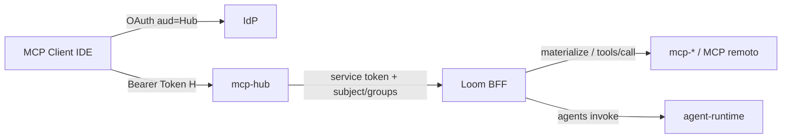
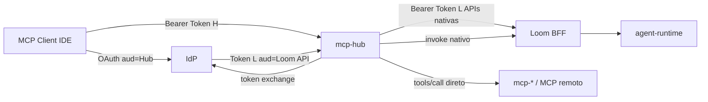
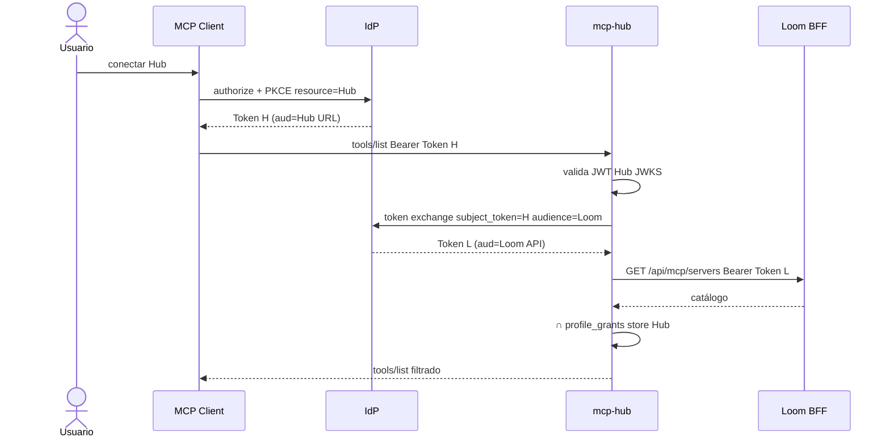
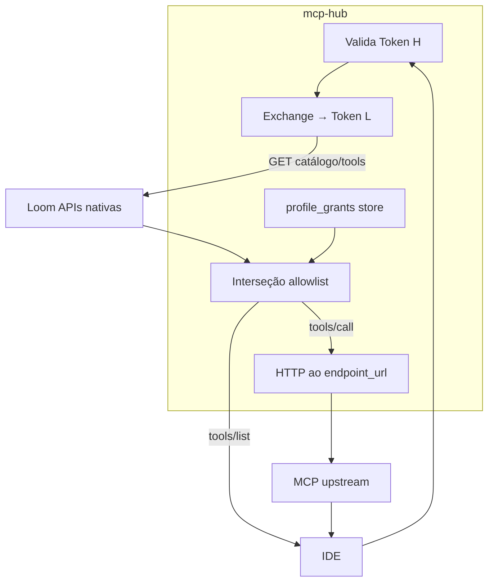
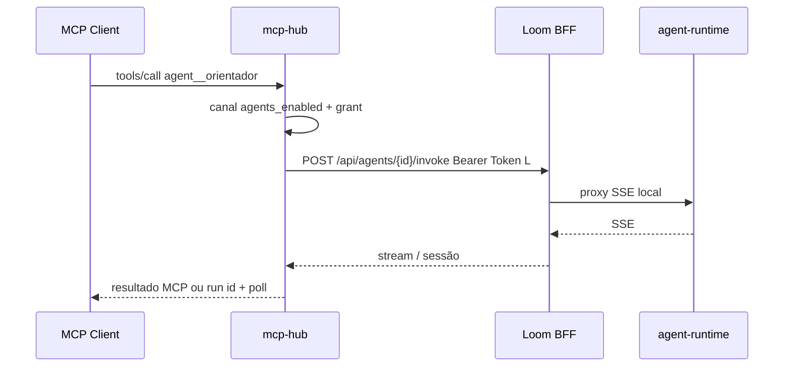

# 15. MCP Hub como cliente das APIs Loom (Core sem saber do Hub)

- **Status:** **Aceito / implementado (fase 5 data-plane)** — dual-aud interim;
  token exchange RFC 8693 opcional via env
- **Data:** 2026-09-15
- **Decisores:** Mantenedores da plataforma / extensão local
- **Relacionada a:**
  [ADR 0006 — Extensão](0006-local-runtime-extension-repo.md),
  [ADR 0007 — MCP Hub](0007-mcp-hub.md),
  [ADR 0011 — OAuth Hub](0011-mcp-hub-oauth-idp.md),
  [ADR 0012 — Agents as tools](0012-mcp-hub-agents-as-tools.md),
  [ADR 0014 — MCP host HTTP](0014-mcp-host-isolated-http-registration.md)
- **Objetivo de produto:** Loom **estável e syncável** com upstream; features
  locais **em torno** do Core, sem o Core importar nomes/tokens/routers da
  extensão.

## Problema

O Hub já é um **sidecar** (`local-runtime/services/mcp-hub`), mas o **contrato
com o BFF** ainda acopla o Core ao produto Hub:

```text
mcp-hub  ──service token──►  POST /api/mcp/hub/materialize-*
                             POST /api/mcp/hub/tools/call
                             POST /api/mcp/hub/agents/*
```

Isso implica:

1. router e serviços `mcp_hub*` no FastAPI Loom (diff vs awslabs/loom);
2. `MCP_HUB_SERVICE_TOKEN` e claims “em nome do user” — Loom **conhece** o Hub;
3. segundo caminho de authz paralelo ao JWT de usuário nas APIs nativas;
4. atrito contínuo no sync upstream (objetivo do fork).

O ideal (ADR 0006 + meta syncável): **Loom só expõe APIs genéricas**; o Hub é
mais um **cliente** com a mesma identidade/RBAC do usuário.

## Princípio

```text
Extensão consome contratos estáveis do Loom.
Loom não importa nomes, tokens nem routers da extensão.
```

Mesmo padrão já aplicado aos hosts MCP ([ADR 0014](0014-mcp-host-isolated-http-registration.md)):
o Core só vê `streamable_http` + URL.

## Decisão (alvo)

1. **Hub valida** o access token OAuth do *resource* Hub (`aud` = URL canônica
   do Hub / client `loom-mcp-hub`) — inalterado ([ADR 0011](0011-mcp-hub-oauth-idp.md)).
2. **Para chamar Loom**, o Hub obtém um bearer com `aud` das APIs Loom:
   - **Interim (implementado):** dual-audience no IdP — o client `loom-mcp-hub`
     também emite `aud=loom-frontend` no mesmo JWT (`LOOM_ACCESS_TOKEN_MODE=dual_aud`).
   - **Alvo:** **token exchange** RFC 8693 quando
     `LOOM_TOKEN_EXCHANGE_CLIENT_ID` (+ secret) estiverem configurados.
3. **Allowlist MCP:** Hub lê catálogo/tools via APIs nativas
   (`GET /api/mcp/servers/{id}`, `…/tools`) com JWT Loom e **intersecta** com
   `profile_grants` no store do Hub (grants **não** migram para o Postgres Loom).
4. **`tools/call` MCP:** após o grant, o Hub chama o **upstream**
   (`endpoint_url` do catálogo) diretamente — sem `POST /api/mcp/hub/tools/call`.
5. **`agent__*`:** list via `GET /api/agents`; invoke via
   `POST /api/agents/{id}/invoke` (SSE); runs em cache local do Hub.
6. **Remover do Core** (**feito**): data-plane
   `materialize*` / `tools/call` / `agents/*` e serviços associados.
   Restam: `GET /api/mcp/hub/info` + `/api/ext/local-runtime/*` (ops/plugin;
   service token só Hub↔BFF admin).
7. **Ops UI** (plugin): clients/grants/analytics via BFF ext → Hub
   (`:8790`) com service token.

### Congelamento imediato (mesmo antes da implementação)

- Não adicionar novas rotas `/api/mcp/hub/*` no Core.
- Features novas do Hub moram só em `local-runtime/services/mcp-hub` (+ plugin).

## Diagramas

### Hoje (acoplado)



O BFF expõe superfície **só do Hub**. Sync upstream carrega essa dívida.

### Alvo (Loom não conhece Hub)



### Token exchange (detalhe)



Analogia: crachá do prédio Hub (Token H). Na catraca Loom, o balcão IdP
emite crachá Loom (Token L). O prédio Loom **não** aceita o crachá Hub.

### `tools/list` e `tools/call` (alvo)



### Agents como tools (alvo)



## Fases sugeridas

| Fase | Entrega | Complexidade | Risco |
|------|---------|--------------|-------|
| 0 | Este ADR + freeze de rotas Hub no Core | Baixa | Baixo |
| 1 | Token exchange IdP (Keycloak local primeiro) + cache Token L | Alta | Alto |
| 2 | Materialize = catálogo nativo ∩ grants Hub | Média | Médio |
| 3 | `tools/call` MCP → upstream direto no Hub | Média | Médio (SSRF/egress) |
| 4 | `agent__*` → invoke nativo | Média–alta | Médio |
| 5 | Remover service token + `/api/mcp/hub/*` data plane do Core | Baixa–média | Médio se 1–4 incompletos |

**Dependência:** fase 1 desbloqueia 2–4 se o Hub ainda precisar de APIs Loom.
Fase 3 reduz dependência do BFF no hot path de tools MCP.

## Alternativas

| # | Ideia | Veredito |
|---|--------|----------|
| 1 | Manter service token + `/api/mcp/hub` | **Status quo** — ok se sync Core não for prioridade; **rejeitada** como destino dado o objetivo syncável |
| 2 | Aceitar Token H (`aud` Hub) nas rotas Loom | **Rejeitada** — mistura superfícies; ADR 0011 |
| 3 | Mover `profile_grants` para Postgres Loom | **Rejeitada** — Core passaria a conhecer o produto Hub |
| 4 | Hub nunca chama Loom (só MCP URLs estáticas) | **Insuficiente** — perde catálogo/RBAC agents dinâmicos |
| 5 | Token exchange + Hub cliente APIs nativas | **Escolhida (alvo)** |

## Consequências

- Mais complexidade **na extensão** (OAuth exchange, egress MCP, adaptação
  invoke) em troca de Core magro e sync upstream mais limpo.
- Grants e clients Hub permanecem no store da extensão.
- Telemetria/analytics Hub preferencialmente no sidecar; painéis no plugin
  falam com Hub ou com APIs Loom genéricas.
- Até a fase 5, o caminho atual continua válido; este ADR é **norte**, não
  big-bang.

## Não-objetivos (rascunho)

- Implementar exchange nesta entrega
- Redesign do Extension Host
- Remover o plugin Loom (ops UI)
- Mudar o OAuth do IDE para `aud=loom-frontend` (proibido)

## Critérios de pronto (quando Aceito + implementado)

- [x] Hub sobe e serve IDE **sem** rotas data-plane `/api/mcp/hub/materialize*` /
      `tools/call` / `agents/*` no Core (service token só ops/plugin)
- [x] Nenhuma rota data-plane `/api/mcp/hub/materialize*` / `tools/call` /
      `agents/*` no Core
- [x] Token H rejeitado pelo FastAPI nas APIs nativas; Hub usa Token L
      (dual-aud / exchange) para catálogo e agents
- [x] `make local.up` + Cursor → Hub: list/call MCP documentados (agents:
      escopos nativos `/api/agents`)
- [x] Changelog + architecture L3 Hub atualizados

## Referências

- RFC 8693 — OAuth 2.0 Token Exchange  
- RFC 8707 — Resource Indicators  
- Specs Hub: [016](../specs/016-mcp-hub-contract.md), [024](../specs/024-mcp-hub-oauth.md),
  [018](../specs/018-mcp-hub-allowlist.md), [025](../specs/025-mcp-hub-agents-as-tools.md)
