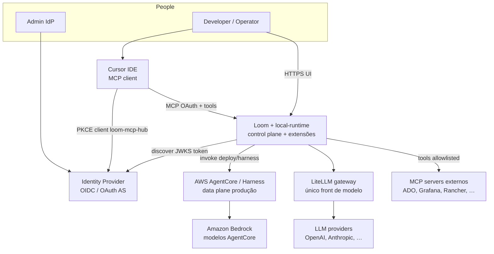
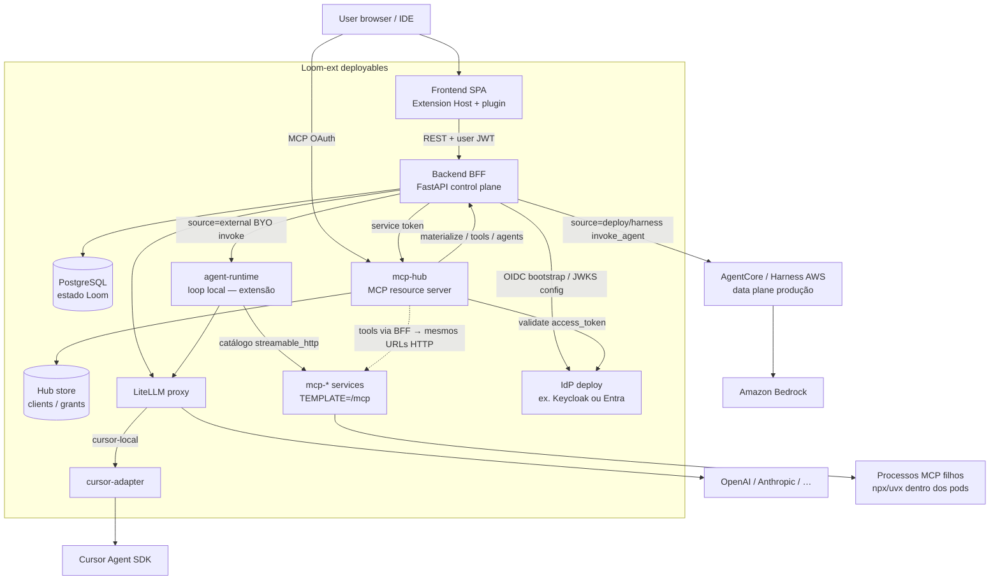
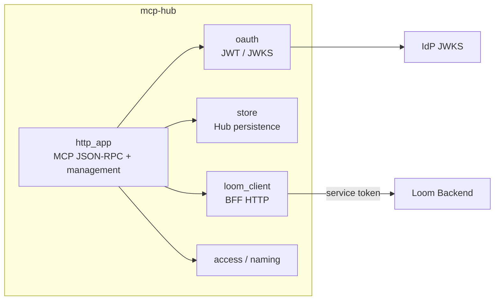
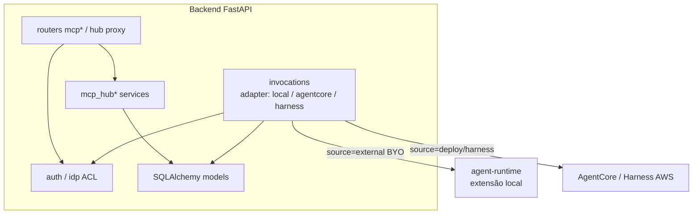
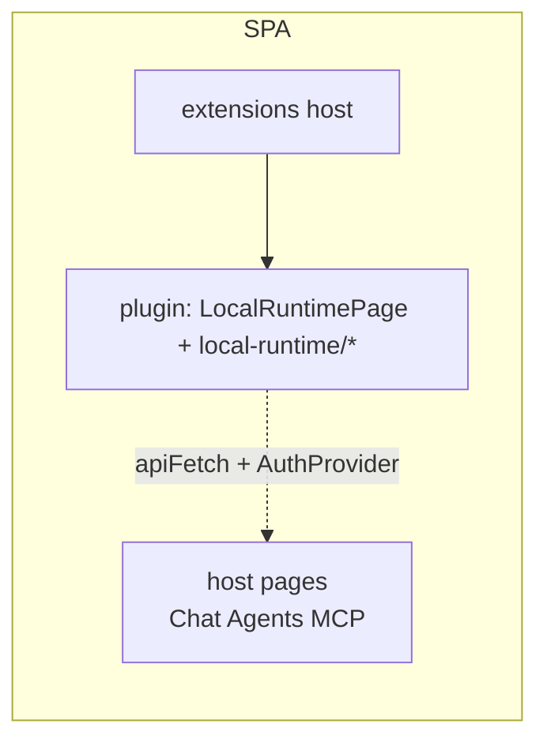
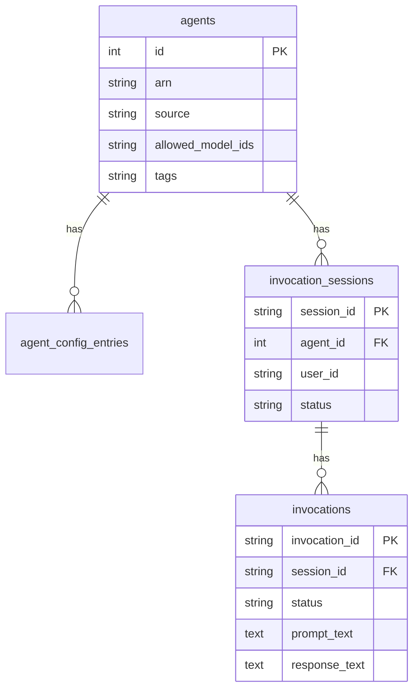
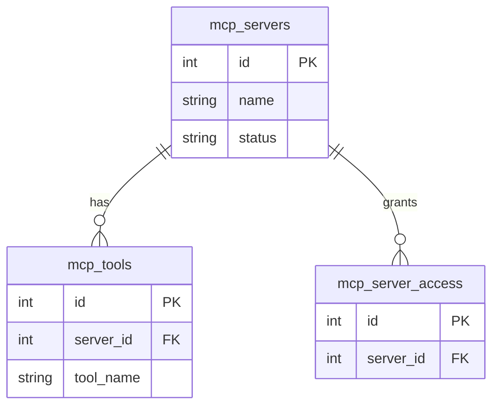
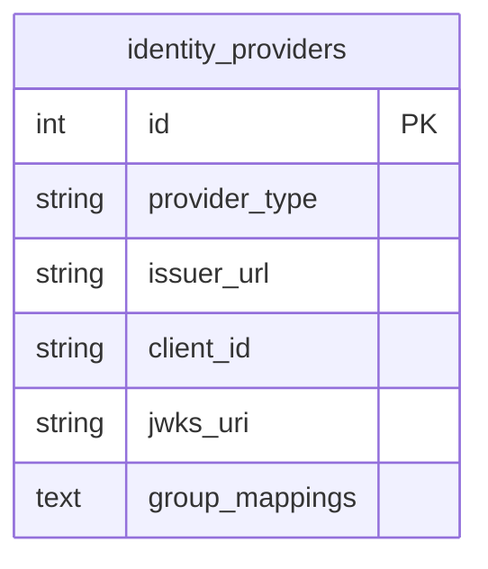

# Arquitetura (C4 + modelo de dados)

Visão atual do **fork** Loom + `local-runtime` (co-located).  
Atualizar **sempre** que a arquitetura mudar — ver [rules.md](rules.md) § Manutenção desta arquitetura.

**Princípio:** `local-runtime` **estende** o Loom — não substitui o data plane de
produção. AgentCore / harness na AWS e Bedrock (no caminho AgentCore) continuam
no desenho; sidecars locais são caminhos **adicionais** (laptop / compose), com
o mesmo BFF como control plane. LiteLLM é o único front de modelo e aponta para
provedores de chat (OpenAI, Anthropic, …) — **não** para Bedrock.

| Nível C4 | Conteúdo |
|----------|----------|
| **L1 Context** | Sistema no mundo (pessoas + sistemas externos) |
| **L2 Containers** | Processos / deployables (Core + extensão local) |
| **L3 Components** | Peças internas dos containers críticos |
| **Dados** | Postgres (Loom) + store Hub + IdP |

Diagramas em **Mermaid portátil** (`flowchart` / `erDiagram`) — equivalentes C4.
Não usar sintaxe `C4Context`/`C4Container`/`C4Component` (muitos previews não renderizam).

**Produção vs local:** URLs, portas e secrets vêm de **variáveis de ambiente / compose**
(`MCP_HUB_*`, `AGENT_RUNTIME_*`, `LOOM_DATABASE_URL`, issuer IdP, etc.). Nada disso
é contrato fixo da arquitetura — o diagrama descreve **papéis e relações**.

Relacionados: [ADR 0005](../adr/0005-local-agent-runtime.md),
[ADR 0006](../adr/0006-local-runtime-extension-repo.md),
[spec 003 LiteLLM](../specs/003-litellm-as-sole-llm-gateway.md),
[overview](overview.md), [scalability-reliability.md](scalability-reliability.md),
[CHANGELOG-LOOM-FORK.md](../CHANGELOG-LOOM-FORK.md).

**Última revisão:** 2026-09-15 (ADR 0014: Loom HTTP-only; mcp-* `TEMPLATE=/mcp`; mint Hub removido; BYO `source=external`)

---

## L1 — System Context



AgentCore (e Bedrock no data plane AWS) e os provedores atrás do LiteLLM são
**sistemas externos** do produto Loom. O stack `local-runtime` não os remove —
acrescenta runtimes/MCP locais e o Hub OAuth no mesmo control plane. LiteLLM
**não** roteia para Bedrock; Bedrock fica no caminho AgentCore.

---

## L2 — Containers



Invoke no BFF escolhe o **adapter** (`local` | `agentcore` | `harness`) — ver
[ADR 0005](../adr/0005-local-agent-runtime.md). LiteLLM serve o **caminho local**
(agent-runtime / BFF) com OpenAI, Anthropic e `cursor-local`
([spec 003](../specs/003-litellm-as-sole-llm-gateway.md)). AgentCore usa
**Bedrock** no data plane AWS — sem seta LiteLLM ↔ AgentCore neste desenho.

### MCP local (ADR 0014)

```text
overlay: mcp-azure-devops / mcp-rancher / mcp-grafana
         (mesma imagem, TEMPLATE= distinto) → POST /mcp
                    │
                    ▼
Loom UI form: streamable_http + URL http://mcp-*:8787/mcp
                    │
                    ▼
agent-runtime / Hub tools (via BFF) — HTTP `auth=none` (lateral trust nos pods)
```

O BFF **não** provisiona processos MCP (`MCP_RUNTIME_URL` removido). Stdio
fica **só** dentro do container `mcp-*`.

### Endpoints (configuráveis)

Contrato = **nome do serviço + env**. Valores abaixo são só referência do compose
local de desenvolvimento; em produção use DNS/TLS e secrets store.

| Papel | Env / config típica | Exemplo local (não normativo) |
|-------|---------------------|-------------------------------|
| UI | frontend origin | `http://localhost:5173` |
| BFF | API base | `http://localhost:8000` |
| MCP Hub resource | `MCP_HUB_PUBLIC_URL` | `http://127.0.0.1:8790/mcp` |
| Hub → BFF | `MCP_HUB_INTERNAL_URL` + `MCP_HUB_SERVICE_TOKEN` | service network |
| MCP hosts (extension) | URLs no catálogo Loom (`auth=none`) | `http://mcp-azure-devops:8787/mcp`, … |
| agent-runtime (extensão) | `AGENT_RUNTIME_URL` + `AGENT_RUNTIME_TOKEN` | service network; **pool** de réplicas ([ADR 0013](../adr/0013-local-agent-templates-worker-pool.md), [spec 027](../specs/027-local-agent-worker-pool.md)) |
| AgentCore / harness (produção) | credenciais AWS / ARNs no BFF | conta AWS |
| LiteLLM | discovery / proxy URL | compose service |
| LLM backends (via LiteLLM) | config LiteLLM (OpenAI, Anthropic, …) | API keys em env/secrets |
| Bedrock (via AgentCore) | ARNs / IAM no data plane AWS | conta AWS |
| Postgres | `LOOM_DATABASE_URL` | compose service |
| IdP | issuer / JWKS from `identity_providers` or env bootstrap | Keycloak ou Entra |

---

## L3 — Components (recortes críticos)

### L3a — MCP Hub



Fluxo: IDE OAuth → JWT → `tools/list` (grants + `agent__*` se habilitado) → `tools/call` → BFF.

### L3b — Backend BFF (fork-relevant)



### L3c — Frontend + plugin



---

## Modelo de dados

Legenda de **origem**:

| Tag | Significado |
|-----|-------------|
| **Core Loom** | Schema da plataforma [awslabs/loom](https://github.com/awslabs/loom) — tabelas/conceitos upstream |
| **Fork (PG)** | Objetos ou colunas no **mesmo Postgres do backend Loom**, introduzidos/estendidos por este fork (ainda em `backend/` — Zona Core no changelog) |
| **local-runtime** | Persistência **fora** do Postgres Loom (sidecars / IdP local) |

Criação no backend: `init_db()` → `create_all` + `_migrate_add_columns` (sem Alembic). Boot do backend.

---

### 1) Core Loom — PostgreSQL (plataforma)

Tabelas upstream típicas (não é inventário exaustivo de colunas):

| Área | Tabelas |
|------|---------|
| Agents / invoke | `agents`, `agent_config_entries`, `invocation_sessions`, `invocations` |
| MCP catalog | `mcp_servers`, `mcp_tools`, `mcp_server_access` |
| Memória / A2A | `memories`, `a2a_agents`, `a2a_agent_skills`, `a2a_agent_access` |
| Authz / creds | `authorizer_configs`, `authorizer_credentials`, `credential_providers` |
| Políticas / tags | `tag_profiles`, `tag_policies`, `approval_*`, `permission_requests` |
| Ops | `audit_*`, `site_settings`, `managed_roles`, `vpc_configs`, `agent_integrations` |

#### ER — agents / invoke (**Core Loom**)



#### ER — MCP catalog (**Core Loom** + extensão de colunas no fork)

Tabelas `mcp_*` são **Core Loom**. Colunas de runtime/template no fork: ver §2.



---

### 2) Fork (PG) — customizações no Postgres do Loom

Objetos/colunas que **não** devem ser tratados como “só local-runtime”: vivem no BFF e no schema Loom (impacto em sync `upstream`).

| Objeto | Tipo | Notas |
|--------|------|--------|
| `identity_providers` | **Tabela nova (fork)** | ACL multi-IdP (Keycloak/Entra/…) |
| `mcp_servers.delegation_mode` / OBO fields | **Colunas (fork)** | Delegação m2m/obo |
| Seeds Orientador (`agents` source=external / BYO) | **Dados (fork)** | Linhas/config; tabela `agents` continua Core |

> Catálogo MCP Loom = só `sse` / `streamable_http` (upstream). Sem colunas
> stdio; sem tabela mint. Hosts locais = serviços Compose `mcp-*`
> ([guia](mcp-host-http-registration.md)).



Auth do Hub IDE = OAuth IdP (ADR 0011). Sem tabela mint no Postgres Loom.

---

### 3) local-runtime — stores fora do Postgres Loom

| Store | Onde | Conteúdo |
|-------|------|----------|
| `hub_clients` / `hub_session_bindings` / **`hub_telemetry_events`** | **local-runtime** Hub PG | Canais MCP, grants, session bindings, tráfego list/call (Spec 028) |
| **JSON fallback** | `MCP_HUB_STORE_PATH` (só se DSN unset; ou fonte de migrate) | Snapshot legado |
| **Keycloak DB** | Container Keycloak | Realm `loom`, users/groups, client `loom-mcp-hub` |
| **Templates YAML (MCP host)** | `local-runtime/services/mcp-runtime/templates/` | Allowlist do processo filho — dono: **mcp-runtime** (`TEMPLATE=`) |

#### Hub store schema (Postgres `mcp_hub`)

```text
hub_clients(slug PK, display_name, declared_*, status, agents_enabled, grants JSONB, first_seen_at, last_seen_at)
hub_session_bindings(hub_session_id PK, mcp_client_slug FK, bound_at)
hub_telemetry_events(id, occurred_at, event_type, request_id, hub_session_id, mcp_client_slug,
                     subject_hash, idp_groups, tool_name, original_tool, server_id, phase,
                     error_code, duration_ms, meta)  -- Spec 028; ensure DDL em pg_store
```

Init DB: `etc/docker/postgres-init/02-mcp-hub-db.sql` (volume Postgres **novo**).  
Tabelas Hub: ensure DDL no `pg_store` (incl. `hub_telemetry_events`).  
Não misturar com schema/ORM do Loom Core.

---

### 4) Relação lógica entre origens

| Conceito | Origem | Liga a |
|----------|--------|--------|
| `profile_grants[].server_id` | **local-runtime** Hub PG | **Core** `mcp_servers.id` |
| `agents_enabled` | **local-runtime** Hub PG | **Core** `agents` + RBAC tags (invoke via BFF) |
| Runs `agent__*` / Chat invoke | BFF cria **Core** `invocation_sessions` / `invocations` | Adapter **local** → agent-runtime; **deploy/harness** → AgentCore (produção) |
| Modelo LLM | LiteLLM (único gateway do control plane) | OpenAI / Anthropic / …; `cursor-local` → cursor-adapter. Bedrock → AgentCore |
| IdP ativo | **Fork (PG)** `identity_providers` | Keycloak/Entra (**local-runtime** / SaaS) |
| MCP local HTTP | **Core** `mcp_servers` (URL `http://mcp-*:8787/mcp`) | **Extension** pods `TEMPLATE=` ([ADR 0014](../adr/0014-mcp-host-isolated-http-registration.md)) |
| Template agent BYO | **Extension** YAML (`agent-runtime/templates/`, [spec 026](../specs/026-local-agent-templates.md)); loader `yaml_agent_templates` | `agents.source=external` + escopo materializado no invoke ([ADR 0013](../adr/0013-local-agent-templates-worker-pool.md)) |

```text
                    ┌──────────────────────────────┐
                    │  local-runtime               │
                    │  mcp-* (TEMPLATE=/mcp)       │
                    │  Postgres DB mcp_hub         │
                    │  agent-runtime / Keycloak    │
                    └────────────┬─────────────────┘
                                 │ streamable_http + OAuth
                    ┌────────────▼─────────────────┐
                    │  Postgres Loom + BFF         │
                    │  mcp_servers (HTTP only)     │
                    │  + Fork tables/columns       │
                    └──────────────────────────────┘
```

---

## Manutenção

Qualquer mudança de containers, portas, fluxos auth, stores ou tabelas **deve** atualizar este arquivo no mesmo PR/entrega — e marcar se a mudança é **Core Loom**, **Fork (PG)** ou **local-runtime**. Regra canônica em [rules.md](rules.md).
