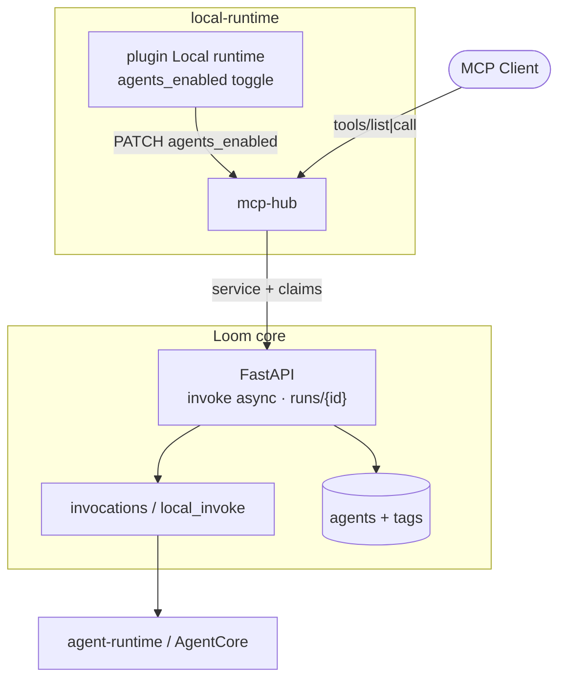
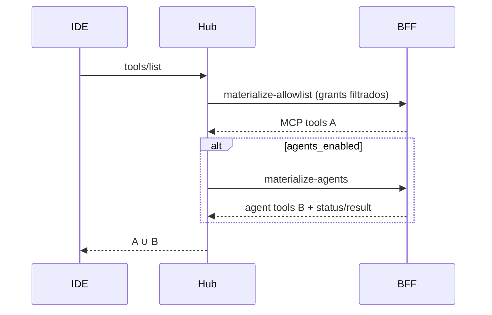
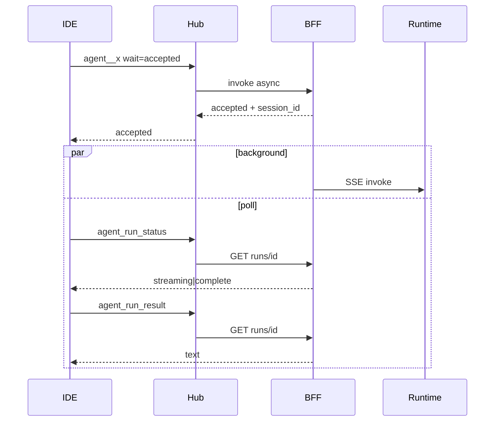

# Spec 025 — Agents Loom como tools MCP no Hub

- **Status:** Rascunho — **fluxo BFF `/api/mcp/hub/agents*` supersedido por [ADR 0015](../adr/0015-mcp-hub-as-loom-api-client.md)**
  (`agent__*` → `/api/agents` com user JWT)
- **Data:** 2026-09-14
- **Atualizado:** 2026-09-15 — ADR 0015
- **Implementa:** [ADR 0012](../adr/0012-mcp-hub-agents-as-tools.md)
- **Depende de:**
  [016](016-mcp-hub-contract.md),
  [017](017-mcp-hub-session.md),
  [018](018-mcp-hub-allowlist.md),
  [021](021-mcp-hub-clients.md),
  [023](023-mcp-hub-profile-grants.md),
  [024](024-mcp-hub-oauth.md),
  [011](011-local-agent-runtime-contract.md)

## 1. Objetivo

Expor agents Loom como tools MCP no Hub **somente** quando:

1. o MCP Client (canal) está `enabled` **e** `agents_enabled=true`;
2. o user do JWT pode invocar o agent (RBAC `loom:group` + scope `invoke`).

Não criar grants de agent por canal/perfil. Profile grants (023) continuam
só para **servers MCP**.

## 2. Flag do canal

Campo no store do MCP Client (extensão):

```text
agents_enabled: boolean   # default false
```

| `status` | `agents_enabled` | Tools `agent__*` |
|----------|------------------|------------------|
| ≠ enabled | * | ausentes |
| enabled | false | ausentes |
| enabled | true | filtradas por RBAC |

API admin (Hub / proxy BFF):

```text
PATCH .../mcp-clients/{slug}
  { "agents_enabled": true | false }
```

(Ou campo no PUT de enable existente — detalhe de implementação livre desde
que o default seja `false`.)

## 3. Naming

| Campo | Regra |
|-------|--------|
| Prefixo | `agent__` (dois underscores) |
| Slug | lower-case; não alfanumérico → `-`; trim |
| Estável | preferir slug de `name` / runtime id; colisão → `agent__{slug}__{id}` |
| Proibido | prefixo `loom_` |

Exemplo: agent “Orientador Acadêmico” id=12 → `agent__orientador-academico`
(ou `agent__orientador-academico__12` se colidir).

## 4. Tools e schemas

### 4.1 Por agent — `agent__{slug}`

```text
inputSchema:
  type: object
  required: [prompt]
  properties:
    prompt:     { type: string }
    session_id: { type: string, description: "opcional; continua conversa" }
    wait:       { type: string, enum: ["accepted", "complete"], default: "accepted" }
```

**`wait=accepted` (default)** — result imediato:

```text
{
  "content": [{ "type": "text", "text": "Run accepted. session_id=…" }],
  "structuredContent": {
    "status": "accepted",
    "session_id": "...",
    "invocation_id": "...",
    "agent_id": 12
  }
}
```

**`wait=complete`** — atalho síncrono (timeout BFF; se estourar, devolve
`status=timeout` + `session_id` para poll — não perde a run):

```text
structuredContent: {
  "status": "ok" | "error" | "timeout",
  "session_id": "...",
  "agent_id": 12,
  "text": "<agregado se ok>"
}
```

### 4.2 Monitoramento (sempre se `agents_enabled`)

```text
agent_run_status
  input:  { session_id }
  output: { status, session_id, invocation_id?, updated_at, preview? }

agent_run_result
  input:  { session_id }
  output: { status: "ok", text, session_id } | erro se não complete
```

RBAC: só o `subject` dono da sessão (ou `g-admins-super`) lê status/result.

`isError: true` se RBAC negar, agent/sessão inexistente, ou invoke falhar
na aceitação.

## 5. RBAC (core Loom)

Autoridade: mesma função do Chat — `user_can_invoke_agent(user, agent)` +
user deve ter scope `invoke` (derivado dos groups JWT via `GROUP_SCOPES`).

| Condição | Resultado |
|----------|-----------|
| `g-admins-super` | todos os agents ativos elegíveis |
| agent sem `loom:group` | permitido se `invoke` |
| `loom:group=demo` | user com `g-users-demo` ou `g-admins-demo` |
| sem match | agent **não** entra em `tools/list`; call → 403 / MCP error |

Vocabulário: tag short no agent; groups canônicos no JWT (strip
`g-users-` / `g-admins-`). **Não** usar short tag nos profile grants MCP.

## 6. BFF

Service auth: `MCP_HUB_SERVICE_TOKEN` (igual materialize/tools-call).
Claims: `subject` + `groups[]` (Hub confia no JWT; BFF **revalida** RBAC).

### 6.1 Materializar agents

```text
POST /api/mcp/hub/materialize-agents
Authorization: Bearer <service>
{
  "subject": "...",
  "groups": ["g-users-demo", "t-user"],
  "contract_version": "2026-09-hub-1"
}
→ 200 {
  "agents": [
    {
      "agent_id": 12,
      "slug": "orientador-academico",
      "exposed_name": "agent__orientador-academico",
      "name": "Orientador Acadêmico",
      "description": "...",
      "inputSchema": { ... }
    }
  ]
}
```

Só agents que passam RBAC + estão invocáveis (ex. `source=local` ready,
ou AgentCore/harness com endpoint; excluir soft-deleted / inactive).

### 6.2 Invoke (aceitar run)

```text
POST /api/mcp/hub/agents/invoke
Authorization: Bearer <service>
{
  "subject": "...",
  "groups": ["g-users-demo"],
  "agent_id": 12,
  "prompt": "...",
  "session_id": null,
  "mode": "async" | "sync",
  "timeout_s": 120
}
→ 202/200 {
  "status": "accepted" | "ok" | "error" | "timeout",
  "session_id": "...",
  "invocation_id": "...",
  "text": null | "..."
}
→ 403 { "detail": "agent_forbidden" }
→ 404 { "detail": "agent_not_found" }
```

- `mode=async` (default do Hub): cria sessão/invocation, dispara dispatch
  **sem** bloquear a resposta MCP; run vive no BFF/runtime.
- `mode=sync`: buffer SSE até complete|timeout|error; em timeout a run
  **continua** e o client usa poll.

### 6.3 Status / result

```text
GET /api/mcp/hub/agents/runs/{session_id}
  ?subject=...   # ou body/header claims alinhados ao Hub
→ 200 {
  "session_id", "invocation_id", "agent_id",
  "status": "pending"|"streaming"|"complete"|"error",
  "preview": "...",      # opcional
  "text": "..." | null,  # preenchido se complete
  "error_message": null
}
→ 403 / 404
```

Implementação: reusar tabelas/estado de `invocations` (paridade Chat).
Hub **não** armazena o transcript; só proxy.

### 6.4 Progress (opcional)

Com `mode=sync` / `wait=complete`, enquanto a call MCP estiver aberta o Hub
pode mapear eventos SSE → `notifications/progress`. Não substitui 6.3.

## 7. Hub runtime

### 7.1 `tools/list`

```text
A = tools MCP de profile grants (023 / 018)
B = []
if client.enabled and client.agents_enabled:
  B = materialize-agents → agent__*
    ∪ [ agent_run_status, agent_run_result ]
return A ∪ B
```

### 7.2 `tools/call`

```text
if name in (agent_run_status, agent_run_result):
  GET agents/runs/{session_id} → mapear MCP result
elif name.startswith("agent__"):
  if not client.agents_enabled: → erro
  wait = args.wait or "accepted"
  POST agents/invoke mode=async|sync
  mapear → MCP tool result (accepted / ok / timeout / error)
else:
  caminho MCP server atual
```

## 8. UI

Local runtime → MCP Client selecionado:

1. Toggle **Expose Loom agents** (`agents_enabled`).
2. Texto de ajuda: visibilidade = `loom:group` do user OAuth no IDE
   (IdP ativo: Keycloak / Microsoft Entra ID).
3. Sem dropdown de perfil para agents; profile dropdown continua só para
   grants de **servers** (023).

## 9. Observabilidade

```text
hub_agents_list_count
hub_agent_invoke_total{agent_id,mode,status}
hub_agent_run_poll_total{status}
hub_agent_invoke_latency_ms          # sync only
hub_agent_run_duration_ms            # accept → complete
```

Correlação: `subject`, `connection_id`, `mcp_client_slug`, `agent_id`,
`session_id`, `invocation_id`.

Monitoramento humano: UI Loom (invocations/Chat) usa a **mesma** sessão.

## 10. Segurança

- Deny-by-default: `agents_enabled=false`.
- BFF revalida RBAC no accept e em cada poll.
- Service token nunca no IDE.
- `session_id` não é secreto global — exige match de `subject` (ou super).
- `wait=complete`: timeout obrigatório; run não é cancelada no timeout
  (cliente deve poll ou cancel explícito futuro).
- Untagged agents: permitido com `invoke` (paridade Chat); preferir tagar.

## 11. C4 — Containers



## 12. C4 — Sequência list



## 12b. C4 — Sequência run async



## 13. Aceite

- [ ] Client `agents_enabled=false` → nenhum `agent__*` / status / result
- [ ] `g-users-demo` vê só agents `loom:group=demo` (+ untagged se política)
- [ ] Default `wait=accepted` → result rápido com `session_id`
- [ ] Run longa: poll `agent_run_status` → `complete` → `agent_run_result`
- [ ] `wait=complete` + timeout → `timeout` + `session_id` ainda polável
- [ ] Subject A não lê `session_id` de subject B
- [ ] Tools MCP de servers inalteradas com toggle agents on/off
- [ ] Sem UI de grants de agent por perfil

## 14. Fora de escopo (v1)

- Gateway A2A / task protocol completo
- Stream SSE bruto MCP da resposta do agent
- Grants canal × agent
- Auto-enable `agents_enabled` ao enable do client
- Cancel MCP dedicado (pode reusar cancel de invocations depois)
- Webhook push para o IDE
